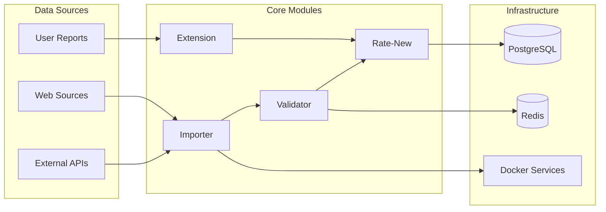

# 🧩 Rate Platform Modules

## 📋 Overview

Rate Platform bao gồm 4 modules chính, mỗi module có vai trò cụ thể trong hệ thống anti-scam ecosystem.

## 🏗️ Module Architecture



## 📊 Module Status Overview

| Module        | Status      | Technology            | Purpose                    | Documentation                    |
| ------------- | ----------- | --------------------- | -------------------------- | -------------------------------- |
| **Extension** | 📋 Planned  | JavaScript/Chrome API | Real-time scam detection   | [📖 Docs](./Extension/)          |
| **Importer**  | 🔄 Active   | Python/FlareSolverr   | Data crawling & collection | [📖 Docs](./Importer/)           |
| **Validator** | ✅ Complete | TypeScript/Jest       | Data validation & rules    | [📖 Docs](./Packages/Validator/) |
| **Rate-New**  | ✅ Active   | Strapi/Next.js        | Core platform & API        | [📖 Docs](../Docs/Modules/Rate/) |

## 🎯 Module Details

### 1. **Extension** - Browser Extension

- **Status**: 📋 Planned
- **Technology**: Manifest V3, Content Scripts, Chrome APIs
- **Purpose**: Real-time scam detection on web pages
- **Features**:
  - Page analysis and risk scoring
  - Quick report submission
  - User notifications and warnings
  - Integration with Rate-New API

**Location**: `Modules/Extension/`  
**Documentation**: [Extension README](./Extension/README.md)

---

### 2. **Importer** - Data Crawler

- **Status**: 🔄 In Active Development
- **Technology**: Python, FlareSolverr, Docker
- **Purpose**: Automated data collection from external sources
- **Features**:
  - CheckScam.vn crawler
  - Cloudflare bypass with FlareSolverr
  - Scheduled data imports
  - API integration with Rate-New

**Location**: `Modules/Importer/`  
**Documentation**: [Importer README](./Importer/README.md)

**Key Components**:

- **Crawler**: Web scraping engine
- **Scripts**: Automation and deployment
- **Results**: Collected data storage
- **Splink**: Record linkage system

---

### 3. **Validator** - Data Validation Engine

- **Status**: ✅ Production Ready
- **Technology**: TypeScript, Zod, Jest
- **Purpose**: Advanced data validation with Vietnamese business rules
- **Features**:
  - Multi-source schema validation
  - Vietnamese phone/bank validation
  - Risk scoring algorithms
  - Quality assessment

**Location**: `Modules/Packages/Validator/`  
**Documentation**: [Validator README](./Packages/Validator/README.md)

**Key Features**:

- **Schema Validator**: Zod-based validation
- **Business Validator**: Vietnamese-specific rules
- **Enrichment Validator**: Risk scoring and location data
- **Utilities**: Phone carriers, bank mapping

**Test Coverage**: 15/15 tests passing ✅

---

### 4. **Rate-New** - Core Platform

- **Status**: ✅ Production Active
- **Technology**: Strapi 5.23.0, Next.js 15, PostgreSQL 17
- **Purpose**: Central API gateway and user interface
- **Features**:
  - Content management system
  - RESTful API endpoints
  - Admin dashboard
  - User authentication

**Location**: `apps/` (Turborepo structure)  
**Documentation**: [Rate README](../Docs/Modules/Rate/README.md)

**Components**:

- **Strapi Backend**: `apps/strapi/` (localhost:1337)
- **Next.js Frontend**: `apps/ui/` (localhost:3000)
- **PostgreSQL**: Docker container
- **Shared Packages**: Validation, configs, design system

## 🔄 Inter-Module Communication

### Data Flow Patterns

```typescript
// Extension → Rate-New
Extension.report() → API.receive() → Database.store()

// Importer → Validator → Rate-New
Crawler.extract() → Validator.validate() → API.store() → Dashboard.display()

// Rate-New → All Modules
API.broadcast() → Redis.publish() → Modules.consume()
```

### API Contracts

**Shared Data Types**:

- `ScamReport`: Common report structure
- `ValidationResult`: Validation output format
- `RiskScore`: Risk assessment data
- `UserProfile`: User information

**Communication Protocols**:

- **REST API**: HTTP endpoints for CRUD operations
- **Redis Stream**: Async message queuing
- **WebSocket**: Real-time updates (planned)

## 🛠️ Development Workflow

### Module Independence

- Each module can be developed independently
- Shared packages for common functionality
- API contracts define integration points
- Comprehensive testing for each module

### Integration Testing

- Cross-module compatibility tests
- Data flow validation
- Performance benchmarking
- Security verification

### Deployment Strategy

- **Extension**: Chrome Web Store
- **Importer**: Docker container deployment
- **Validator**: NPM package distribution
- **Rate-New**: Heroku/Docker deployment

## 📈 Performance Metrics

| Module    | Response Time | Throughput          | Reliability | Test Coverage |
| --------- | ------------- | ------------------- | ----------- | ------------- |
| Extension | < 100ms       | N/A                 | 99.9%       | Planned       |
| Importer  | < 5s/page     | 1000 pages/hour     | 95%         | 80%           |
| Validator | < 50ms        | 10k validations/min | 99.9%       | 100%          |
| Rate-New  | < 200ms       | 1k requests/min     | 99.9%       | 85%           |

## 🔮 Future Roadmap

### Q1 2025

- Complete browser extension development
- Optimize importer performance
- Enhance validator with ML features
- Scale Rate-New infrastructure

### Q2 2025

- Mobile app integration
- Advanced analytics dashboard
- Multi-language support
- API rate limiting and security

### Q3 2025

- Machine learning integration
- Predictive scam detection
- Community features
- International expansion

## 🤝 Contributing

### Module-Specific Guidelines

- Follow each module's coding standards
- Update documentation with changes
- Maintain API contract compatibility
- Add comprehensive tests

### Cross-Module Changes

- Coordinate with other module maintainers
- Update shared packages when needed
- Validate integration points
- Update this overview document

## 📚 Additional Resources

- **[Platform Overview](../Docs/Platform/Overview.md)** - High-level architecture
- **[Development Setup](../Docs/Guides/Development-Setup.md)** - Getting started guide
- **[Roadmap](../Docs/Resources/ROADMAP.md)** - Detailed development timeline
- **[Contributing](../Docs/Resources/Contributing.md)** - Contribution guidelines

---

**Last Updated**: January 2025  
**Maintainer**: Development Team  
**Status**: All modules actively maintained
