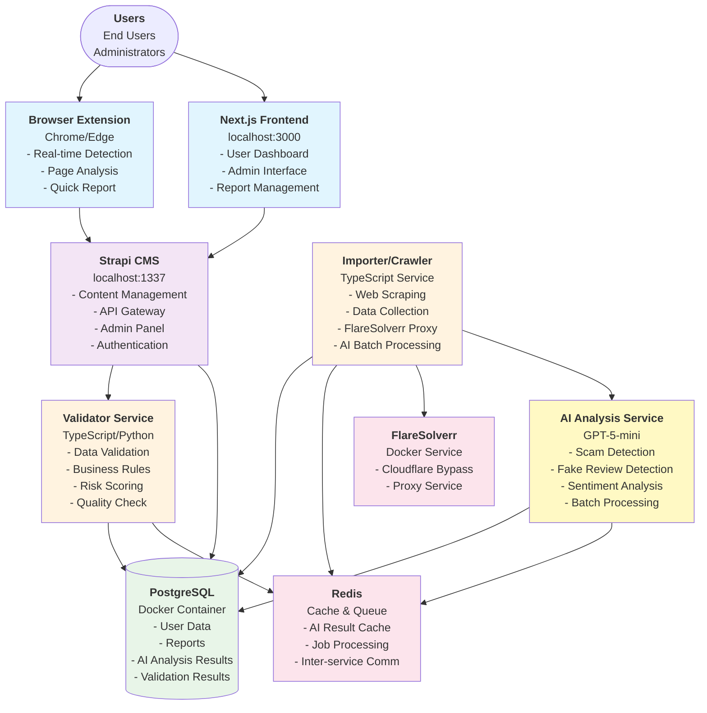

# ⭐ Rate Platform - AI-Powered Review & Rating System


A comprehensive review and rating platform for businesses, services, and products with AI-powered fake review detection, sentiment analysis, and fraud prevention capabilities.

## 🏗️ System Architecture with AI Integration



## 🔄 Complete Data Processing Flow

### 1. Data Collection

```
Multiple Sources → Crawler/Importer → Raw Data Storage
     ↓                    ↓                 ↓
User Reviews         FlareSolverr      JSON Files
Business Data        Anti-captcha      Structured Data
Product Listings     Rate Limiting     Metadata
```

### 2. AI Processing Pipeline

```
Raw Data → AI Analysis (GPT-5-mini) → Enriched Data
    ↓              ↓                      ↓
Reviews      Fake Detection         Confidence Score
Ratings      Sentiment Analysis     Categories
Reports      Pattern Recognition    Severity Level
```

### 3. Validation & Storage

```
Enriched Data → Redis Queue → Validator → PostgreSQL
      ↓             ↓            ↓           ↓
AI Metadata    Async Jobs    Quality     Verified
Confidence     Pub/Sub       Scoring     Reviews
Categories     Caching       Dedup       Ratings
```

### 4. API Distribution

```
Strapi CMS → REST/GraphQL APIs → Client Applications
     ↓              ↓                    ↓
Content Mgmt    Endpoints          Next.js UI
Auth/Perms      Rate Limiting      Browser Ext
Admin Panel     Caching             Mobile Apps
```

## 📊 Key Features

### Core Platform

- **Review Management**: Multi-category reviews (businesses, products, services)
- **Rating System**: 5-star ratings with weighted algorithms
- **User Authentication**: JWT-based auth with social login support
- **Content Moderation**: AI-powered content filtering and approval workflows

### AI Capabilities (GPT-5-mini)

- **Fake Review Detection**: 80%+ accuracy in identifying fake reviews
- **Sentiment Analysis**: Understand customer emotions and feedback patterns
- **Spam Filtering**: Automatic detection of spam and promotional content
- **Fraud Prevention**: Identify scam patterns and suspicious activities
- **Language Support**: Vietnamese and English analysis

### Technical Features

- **Batch Processing**: Handle 50+ reviews per batch (~12s processing)
- **Redis Caching**: 90%+ cache hit rate for duplicate detection
- **Real-time Updates**: WebSocket support for live notifications
- **API Rate Limiting**: Protect against abuse and ensure fair usage
- **Data Validation**: Multi-layer validation pipeline

## 🚀 Performance Metrics

- **AI Processing Speed**: 250 reviews/minute
- **API Response Time**: < 100ms (cached), < 500ms (uncached)
- **Cache Hit Rate**: 90%+ for duplicate content
- **Uptime Target**: 99.9% availability
- **Cost Efficiency**: ~$0.0003 per AI analysis (GPT-5-mini)

## 📚 Documentation

- **[Development Setup](./Docs/Guides/Development-Setup.md)** - Complete setup guide
- **[Modules Overview](./Modules/README.md)** - Technical documentation for all modules
- **[API Documentation](./apps/strapi/README.md)** - Strapi API endpoints and schemas
- **[Frontend Guide](./apps/web/README.md)** - Next.js Web development guide
- **[AI Integration](./packages/ai/README.md)** - AI service documentation

## 👀 Live demo

- UI - [https://www.notum-dev.cz/](https://www.notum-dev.cz/)
- Strapi - [https://api.notum-dev.cz/admin](https://api.notum-dev.cz/admin)
- **Readonly user:**
  - Email: [REDACTED]
  - Password: [REDACTED]

## 🥞 Tech Stack

### Frontend

- **[Next.js v15](https://nextjs.org/)** - React framework with App Router
- **[TailwindCSS v4](https://tailwindcss.com/)** - Utility-first CSS framework
- **[Shadcn/ui](https://ui.shadcn.com/)** - Beautiful UI components
- **[TypeScript](https://www.typescriptlang.org/)** - Type-safe development

### Backend

- **[Strapi v5](https://strapi.io/)** - Headless CMS with REST & GraphQL
- **[PostgreSQL 17](https://www.postgresql.org/)** - Primary database
- **[Redis](https://redis.io/)** - Caching and message queue
- **[Node.js 22](https://nodejs.org/)** - Runtime environment

### AI & Processing

- **[OpenAI GPT-5-mini](https://openai.com/)** - AI analysis engine
- **[FlareSolverr](https://github.com/FlareSolverr/FlareSolverr)** - Anti-bot bypass
- **[Playwright](https://playwright.dev/)** - Browser automation
- **[TypeScript/Python](https://www.python.org/)** - Data processing

### Infrastructure

- **[Turborepo](https://turbo.build/)** - Monorepo management
- **[Docker](https://www.docker.com/)** - Containerization
- **[Yarn Workspaces](https://yarnpkg.com/)** - Package management

## 🚀 Getting started

### Prerequisites

- **Node.js 22.x** - Required runtime
- **Yarn 1.22.x** - Package manager (enforced)
- **PostgreSQL 17** - Database (or use Docker)
- **Docker** - For services (Redis, PostgreSQL, FlareSolverr)
- **OpenAI API Key** - For AI features (GPT-5-mini)

### Quick Start

1. **Clone and Install**

```bash
git clone https://github.com/RateBox/Rate.git
cd Rate
yarn install
```

2. **Environment Setup**

```bash
# Copy environment templates
yarn setup:apps

# Configure AI service (root .env)
echo "OPENAI_API_KEY=your-api-key" >> .env
echo "OPENAI_MODEL=gpt-5-mini" >> .env
echo "AI_CACHE_ENABLED=true" >> .env

# Configure Strapi (apps/strapi/.env)
# Configure Next.js (apps/web/.env.local)
```

3. **Start Services**

```bash
# Start database (if not using local PostgreSQL)
cd apps/strapi && docker compose up -d db && cd ../..

# Start Redis for caching
docker run -d --name redis -p 6379:6379 redis:alpine

# Start all applications
yarn dev
```

4. **Access Points**

- **Frontend**: http://localhost:3000
- **Admin Panel**: http://localhost:1337/admin
- **API**: http://localhost:1337/api
- **GraphQL**: http://localhost:1337/graphql

### AI Processing Workflow

```bash
# 1. Crawl data
cd apps/importer
ts-node-esm Scripts/crawl.ts links
ts-node-esm Scripts/crawl.ts crawl

# 2. Process with AI
ts-node-esm Scripts/ai-batch-processor.ts \
  -i ./Data/crawled \
  -o ./Data/processed

# 3. Push to validation
ts-node-esm Scripts/push-to-validation-with-ai.ts
```

## 📦 Project Structure

### Apps

- **`apps/strapi`** - Strapi v5 CMS backend with custom plugins
- **`apps/web`** - Next.js v15 frontend application
- **`apps/importer`** - Data crawler and importer service

### Packages

- **`packages/ai`** - AI analysis service (GPT-5-mini integration)
- **`packages/validator`** - TypeScript validation schemas
- **`packages/design-system`** - Shared TailwindCSS and CKEditor configs
- **`packages/eslint-config`** - Shared ESLint rules
- **`packages/prettier-config`** - Shared Prettier configuration
- **`packages/typescript-config`** - Shared TypeScript configurations

### Modules

- **`Modules/Extension`** - Browser extension for real-time detection
- **`Modules/Validator`** - Python validation worker service

## 🛠️ Development Commands

```bash
# Development
yarn dev              # Start all services
yarn dev:strapi       # Start Strapi only
yarn dev:ui           # Start Next.js only

# Building
yarn build            # Build all apps
yarn build:strapi     # Build Strapi
yarn build:ui         # Build Next.js

# Code Quality
yarn lint             # Lint all code
yarn format           # Format with Prettier
yarn type-check       # TypeScript checking

# Testing
yarn test             # Run all tests
yarn test-plugin      # Test smart-component-filter plugin
```

## 🚨 Troubleshooting

### Common Issues

**Port already in use:**

```bash
# Windows
netstat -ano | findstr :1337
taskkill /PID <PID> /F

# Linux/Mac
lsof -i :1337
kill -9 <PID>
```

**Database connection failed:**

```bash
# Check PostgreSQL is running
docker ps | grep postgres

# Restart database
docker restart rate-db
```

**AI Service errors:**

- Check OpenAI API key in `.env`
- Verify GPT-5-mini model access
- Check Redis is running for caching

## 📝 Contributing

1. Fork the repository
2. Create feature branch (`git checkout -b feat/amazing-feature`)
3. Commit changes (`git commit -m 'feat: add amazing feature'`)
4. Push to branch (`git push origin feat/amazing-feature`)
5. Open Pull Request

### Commit Convention

We use [Conventional Commits](https://www.conventionalcommits.org/):

- `feat:` New feature
- `fix:` Bug fix
- `docs:` Documentation
- `style:` Code style
- `refactor:` Code refactoring
- `test:` Tests
- `chore:` Maintenance

## 📄 License

MIT License - see [LICENSE](./LICENSE) file for details

## 🙏 Acknowledgments

- Based on [strapi-next-monorepo-starter](https://github.com/notum-cz/strapi-next-monorepo-starter)
- AI powered by OpenAI GPT-5-mini
- UI components by Shadcn/ui
