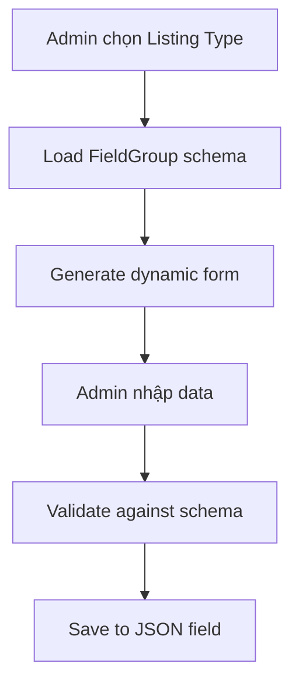
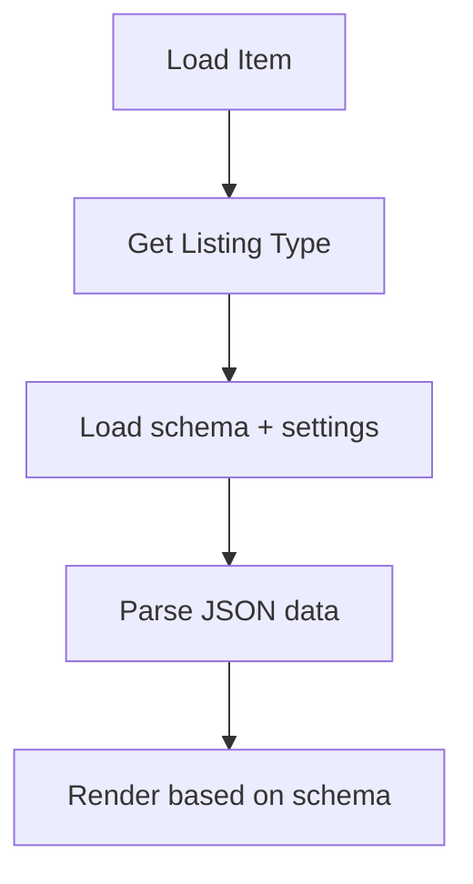
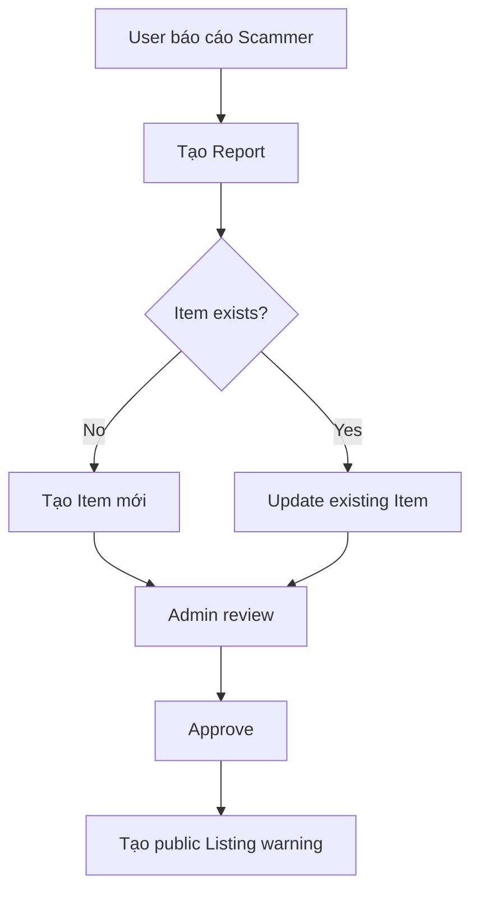

# Dynamic Content Architecture - Rate Platform

## 🏗️ **Core Concepts**

### **System Overview**

Rate platform là một Content Construction Kit (CCK) cho phép tạo các content types khác nhau trong cùng một hệ thống, tương tự như JReviews.

### **Building Blocks**

#### **1. Listing Type**

- **Vai trò**: Blueprint/Schema definition cho một domain cụ thể
- **Chức năng**:
  - Define field structure (FieldGroup)
  - Define rating criteria
  - Define business rules (allowComment, allowRating)
  - Define UI behavior settings

```javascript
// Example: Listing Type "Scammer"
{
  "Name": "Scammer",
  "allowComment": true,
  "allowRating": true,
  "Criteria": [
    { "name": "Mức độ lừa đảo", "weight": 30 },
    { "name": "Bằng chứng", "weight": 25 }
  ],
  "FieldGroup": {
    "type": "dynamiczone",
    "components": [
      "scammer.known-accounts",
      "scammer.risk-assessment"
    ]
  }
}
```

#### **2. Item**

- **Vai trò**: Unique entity/profile container
- **Tương đương**: JReviews Listing (entity duy nhất, không trùng lặp)
- **Chức năng**: Lưu trữ thông tin master về một entity

```javascript
// Example: Item for a scammer
{
  "Title": "Nguyễn Văn A - Scammer Profile",
  "ListingType": "scammer_listing_type_id",
  "Description": "Master profile...",
  "Image": "profile_photo.jpg"
}
```

#### **3. Listing**

- **Vai trò**: Entries/instances about an Item
- **Concept**: 1 Item có thể có nhiều Listings (như 1 product có nhiều sellers)
- **Chức năng**: Specific instances, reports, variants

```javascript
// Example: Listings about a scammer
Listing 1: "Romance Scam Warning - Victim A"
Listing 2: "Investment Fraud Warning - Victim B"
Listing 3: "Crypto Scam Warning - Victim C"
// → Tất cả link về cùng 1 Item (scammer profile)
```

#### **4. Relationships**

```
Directory (People)
  └── Category (Romance Scam, Investment Fraud)
      └── Listing Type (Scammer)
          └── Item (Nguyễn Văn A Profile)
              └── Listings (Individual reports/warnings)
```

---

## 🤔 **Architecture Decision Process**

### **Problem Statement**

Cần system linh hoạt để handle nhiều content types:

- Scammer profiles
- Product reviews
- Gamer profiles
- Singer profiles
- Business listings
- ... 50+ potential types

**Requirements:**

1. **Flexible schema** per content type
2. **Scalable** to millions of records
3. **Maintainable** codebase
4. **Performance** acceptable
5. **Admin-friendly** UI

### **Options Considered**

#### **Option 1: Full Tables (Rejected)**

**Concept**: Mỗi Listing Type = 1 dedicated table

```javascript
// 50+ tables
ScammerProfile: { risk_level, total_victims, known_accounts, ... }
GamerProfile: { skill_level, achievements, tournament_history, ... }
SingerProfile: { genre, discography, concert_history, ... }
```

**✅ Pros:**

- Best performance (⭐⭐⭐⭐⭐)
- Type safety
- Native Strapi admin UI

**❌ Cons:**

- 50+ content types to maintain
- Complex Item relationships (50 optional foreign keys)
- Schema evolution painful
- Category mapping complexity

**Verdict**: Relationship hell, không scalable maintenance-wise

#### **Option 2: Hybrid (Columns + JSON) (Rejected)**

**Concept**: Common fields thành columns, specific fields thành JSON

```javascript
Item: {
  "overall_rating": "decimal",    // Common indexed field
  "view_count": "integer",        // Common indexed field
  "extended_data": "json"         // Type-specific data
}
```

**Analysis:**

- Chỉ ~5 truly common fields
- 80% queries vẫn cần type-specific data (JSON queries)
- Performance gain minimal (~10-15%)
- Same implementation complexity như pure JSON

**Verdict**: Ít benefit, same effort

#### **Option 3: JSON Approach (Selected) ⭐**

**Concept**: Single table với JSON field, schema defined by Listing Type

```javascript
Item: {
  "title": "string",
  "listing_type": "relation",     // Schema source
  "field_data": "json"           // Dynamic data
}

// Data example:
{
  "field_data": {
    "known_accounts": {
      "phone": "0901234567",
      "facebook": "fb.com/fake"
    },
    "risk_assessment": {
      "risk_level": "High",
      "confidence": 85
    }
  }
}
```

**✅ Pros:**

- ⭐⭐⭐⭐⭐ **Schema Flexibility**: Add new types without migration
- ⭐⭐⭐⭐⭐ **Maintainability**: Single table, clean relationships
- ⭐⭐⭐⭐⭐ **Scalability**: Easy to add 100+ content types
- ⭐⭐⭐⭐ **Architecture Consistency**: Listing Type remains single source of truth
- ⭐⭐⭐ **Performance**: 60-70% of full tables (acceptable với JSONB optimization)

**❌ Cons:**

- JSON parsing overhead
- Custom admin UI needed
- Less type safety

**Verdict**: Best balance cho requirements

---

## 🎯 **Implementation Strategy**

### **JSON Approach - Implementation Options**

#### **Option A: Custom Field Plugin** (Recommended)

```javascript
// Professional Strapi plugin
{
  "field_data": {
    "type": "customField",
    "customField": "plugin::dynamic-forms.smart-form",
    "options": {
      "schemaSource": "listing_type.field_group"
    }
  }
}
```

**Benefits:**

- Native Strapi integration
- Reusable across projects
- Professional solution
- AI can generate complete plugin

#### **Option B: Admin Override**

```javascript
// Custom React component thay thế JSON editor
const DynamicFormField = ({ listingType, value, onChange }) => {
  // Load schema từ Listing Type
  // Render dynamic form
}
```

#### **Option C: Middleware Validation**

```javascript
// Server-side validation only
module.exports = {
  async beforeCreate(event) {
    const schema = await loadListingTypeSchema(data.listing_type)
    validateFieldData(data.field_data, schema)
  },
}
```

### **Performance Optimization**

#### **PostgreSQL JSONB Features**

```sql
-- Indexes on JSON properties
CREATE INDEX idx_items_risk_level ON items
  USING GIN ((field_data->>'risk_level'));

-- Generated columns (PostgreSQL 12+)
ALTER TABLE items ADD COLUMN risk_level_computed
  TEXT GENERATED ALWAYS AS (field_data->>'risk_level');
```

#### **Query Patterns**

```sql
-- Fast indexed queries
SELECT * FROM items WHERE listing_type_id = 123;

-- JSONB queries with indexes
SELECT * FROM items
WHERE field_data->>'risk_level' = 'High'
  AND listing_type_id = 123;
```

---

## 📊 **Performance Expectations**

| Query Type          | Full Tables | JSON + JSONB | Performance Gap |
| ------------------- | ----------- | ------------ | --------------- |
| **Simple filters**  | ~5ms        | ~15ms        | 3x slower       |
| **Complex queries** | ~20ms       | ~80ms        | 4x slower       |
| **Bulk operations** | ~100ms      | ~300ms       | 3x slower       |

**Overall**: JSON approach delivers **60-70% performance** của full tables

**Acceptable vì:**

- Flexibility benefits outweigh performance cost
- Millions of records vẫn handle được
- Can optimize với proper indexing

---

## 🔄 **Data Flow**

### **Admin Workflow**



### **Frontend Display**



### **Report Workflow (Scammer example)**



---

## 🚀 **Next Steps**

### **Phase 1: Core Implementation**

1. ✅ Document architecture (this doc)
2. 🔄 Implement Custom Field Plugin
3. 🔄 Create dynamic form components
4. 🔄 Add schema validation
5. 🔄 Test với Scammer use case

### **Phase 2: Optimization**

1. Add JSONB indexes
2. Performance testing
3. UI/UX improvements
4. Additional content types

### **Phase 3: Advanced Features**

1. Schema migration tools
2. Import/export functionality
3. API optimization
4. Analytics và reporting

---

## 📝 **Technical Notes**

### **Strapi Limitations**

- Dynamic Zone không support dynamic component loading
- Buộc phải define tất cả possible components in schema
- Workaround: JSON field + custom UI

### **PostgreSQL Features Required**

- JSONB data type
- GIN indexes for JSON queries
- Generated columns (optional, for performance)

### **Browser Compatibility**

- Modern browsers supporting ES6+
- React 18+ for admin components

---

**Document Version**: 1.0  
**Last Updated**: 2024-12-19  
**Author**: Architecture Team
