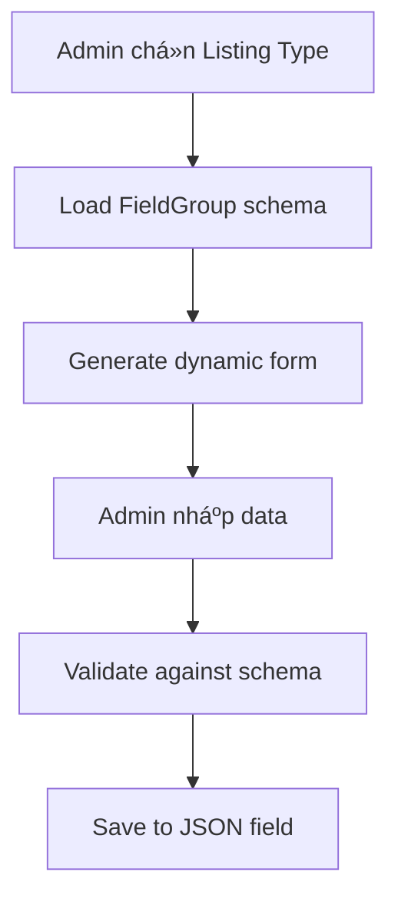
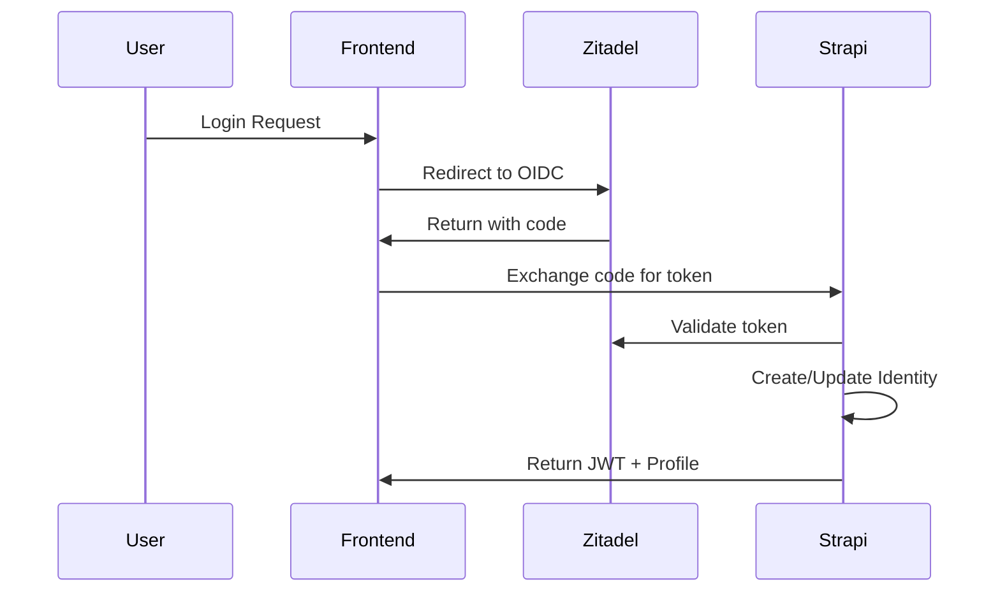

# Dynamic Content Architecture - Rate Platform

## 🏗️ **Core Concepts**

### **System Overview**

Rate platform là một Content Construction Kit (CCK) cho phép tạo các content types khác nhau trong cùng một hệ thống, tương tự như JReviews.

### **Building Blocks**

#### **1. Listing Type**

- **Vai trò**: Blueprint/Schema definition cho một domain cụ thể
- **Chức năng**:
  - Define field structure (FieldGroup)
  - Define rating criteria
  - Define business rules (allowComment, allowRating)
  - Define UI behavior settings

```javascript
// Example: Listing Type "Scammer"
{
  "Name": "Scammer",
  "allowComment": true,
  "allowRating": true,
  "Criteria": [
    { "name": "Mức độ lừa đảo", "weight": 30 },
    { "name": "Bằng chứng", "weight": 25 }
  ],
  "FieldGroup": {
    "type": "dynamiczone",
    "components": [
      "scammer.known-accounts",
      "scammer.risk-assessment"
    ]
  }
}
```

#### **2. Item**

- **Vai trò**: Unique entity/profile container
- **Tương đương**: JReviews Listing (entity duy nhất, không trùng lặp)
- **Chức năng**: Lưu trữ thông tin master về một entity

```javascript
// Example: Item for a scammer
{
  "Title": "Nguyễn Văn A - Scammer Profile",
  "ListingType": "scammer_listing_type_id",
  "Description": "Master profile...",
  "Image": "profile_photo.jpg"
}
```

#### **3. Listing**

- **Vai trò**: Entries/instances about an Item
- **Concept**: 1 Item có thể có nhiều Listings (như 1 product có nhiều sellers)
- **Chức năng**: Specific instances, reports, variants

```javascript
// Example: Listings about a scammer
Listing 1: "Romance Scam Warning - Victim A"
Listing 2: "Investment Fraud Warning - Victim B"
Listing 3: "Crypto Scam Warning - Victim C"
// → Tất cả link về cùng 1 Item (scammer profile)
```

#### **4. Relationships**

```
Directory (People)
  └── Category (Romance Scam, Investment Fraud)
      └── Listing Type (Scammer)
          └── Item (Nguyễn Văn A Profile)
              └── Listings (Individual reports/warnings)
```

---

## 🤔 **Architecture Decision Process**

### **Problem Statement**

Cần system linh hoạt để handle nhiều content types:

- Scammer profiles
- Product reviews
- Gamer profiles
- Singer profiles
- Business listings
- ... 50+ potential types

**Requirements:**

1. **Flexible schema** per content type
2. **Scalable** to millions of records
3. **Maintainable** codebase
4. **Performance** acceptable
5. **Admin-friendly** UI

### **Options Considered**

#### **Option 1: Full Tables (Rejected)**

**Concept**: Mỗi Listing Type = 1 dedicated table

```javascript
// 50+ tables
ScammerProfile: { risk_level, total_victims, known_accounts, ... }
GamerProfile: { skill_level, achievements, tournament_history, ... }
SingerProfile: { genre, discography, concert_history, ... }
```

**✅ Pros:**

- Best performance (⭐⭐⭐⭐⭐)
- Type safety
- Native Strapi admin UI

**❌ Cons:**

- 50+ content types to maintain
- Complex Item relationships (50 optional foreign keys)
- Schema evolution painful
- Category mapping complexity

**Verdict**: Relationship hell, không scalable maintenance-wise

#### **Option 2: Hybrid (Columns + JSON) (Rejected)**

**Concept**: Common fields thành columns, specific fields thành JSON

```javascript
Item: {
  "overall_rating": "decimal",    // Common indexed field
  "view_count": "integer",        // Common indexed field
  "extended_data": "json"         // Type-specific data
}
```

**Analysis:**

- Chỉ ~5 truly common fields
- 80% queries vẫn cần type-specific data (JSON queries)
- Performance gain minimal (~10-15%)
- Same implementation complexity như pure JSON

**Verdict**: Ít benefit, same effort

#### **Option 3: JSON Approach (Selected) ⭐**

**Concept**: Single table với JSON field, schema defined by Listing Type

```javascript
Item: {
  "title": "string",
  "listing_type": "relation",     // Schema source
  "field_data": "json"           // Dynamic data
}

// Data example:
{
  "field_data": {
    "known_accounts": {
      "phone": "0901234567",
      "facebook": "fb.com/fake"
    },
    "risk_assessment": {
      "risk_level": "High",
      "confidence": 85
    }
  }
}
```

**✅ Pros:**

- ⭐⭐⭐⭐⭐ **Schema Flexibility**: Add new types without migration
- ⭐⭐⭐⭐⭐ **Maintainability**: Single table, clean relationships
- ⭐⭐⭐⭐⭐ **Scalability**: Easy to add 100+ content types
- ⭐⭐⭐⭐ **Architecture Consistency**: Listing Type remains single source of truth
- ⭐⭐⭐ **Performance**: 60-70% of full tables (acceptable với JSONB optimization)

**❌ Cons:**

- JSON parsing overhead
- Custom admin UI needed
- Less type safety

**Verdict**: Best balance cho requirements

---

## 🎯 **Implementation Strategy**

### **JSON Approach - Implementation Options**

#### **Option A: Custom Field Plugin** (Recommended)

```javascript
// Professional Strapi plugin
{
  "field_data": {
    "type": "customField",
    "customField": "plugin::dynamic-forms.smart-form",
    "options": {
      "schemaSource": "listing_type.field_group"
    }
  }
}
```

**Benefits:**

- Native Strapi integration
- Reusable across projects
- Professional solution
- AI can generate complete plugin

#### **Option B: Admin Override**

```javascript
// Custom React component thay thế JSON editor
const DynamicFormField = ({ listingType, value, onChange }) => {
  // Load schema từ Listing Type
  // Render dynamic form
}
```

#### **Option C: Middleware Validation**

```javascript
// Server-side validation only
module.exports = {
  async beforeCreate(event) {
    const schema = await loadListingTypeSchema(data.listing_type)
    validateFieldData(data.field_data, schema)
  },
}
```

### **Performance Optimization**

#### **PostgreSQL JSONB Features**

```sql
-- Indexes on JSON properties
CREATE INDEX idx_items_risk_level ON items
  USING GIN ((field_data->>'risk_level'));

-- Generated columns (PostgreSQL 12+)
ALTER TABLE items ADD COLUMN risk_level_computed
  TEXT GENERATED ALWAYS AS (field_data->>'risk_level');
```

#### **Query Patterns**

```sql
-- Fast indexed queries
SELECT * FROM items WHERE listing_type_id = 123;

-- JSONB queries with indexes
SELECT * FROM items
WHERE field_data->>'risk_level' = 'High'
  AND listing_type_id = 123;
```

---

## 📊 **Performance Expectations**

| Query Type          | Full Tables | JSON + JSONB | Performance Gap |
| ------------------- | ----------- | ------------ | --------------- |
| **Simple filters**  | ~5ms        | ~15ms        | 3x slower       |
| **Complex queries** | ~20ms       | ~80ms        | 4x slower       |
| **Bulk operations** | ~100ms      | ~300ms       | 3x slower       |

**Overall**: JSON approach delivers **60-70% performance** của full tables

**Acceptable vì:**

- Flexibility benefits outweigh performance cost
- Millions of records vẫn handle được
- Can optimize với proper indexing

---

## 🔄 **Data Flow**

### **Admin Workflow**



### **Frontend Display**


### **Report Workflow (Scammer example)**

```mermaid
graph TD
    A[User báo cáo Scammer] --> B[Tạo Report]
    B --> C{Item exists?}
    C -->|No| D[Tạo Item mới]
    C -->|Yes| E[Update existing Item]
    D --> F[Admin review]
    E --> F
    F --> G[Approve]
    G --> H[Tạo public Listing warning]
```



---

## 🎛️ **Smart Component Filter Plugin**

### **Overview**

Smart Component Filter là một Strapi plugin được phát triển để giải quyết vấn đề component filtering trong Dynamic Zones dựa trên ListingType data. Plugin tự động ẩn/hiện components trong Component Picker dựa trên schema định nghĩa trong ListingType.

### **Problem Solved**

**Issue**: Strapi Dynamic Zone hiển thị TẤT CẢ available components trong picker, gây confusion khi mỗi ListingType chỉ cần subset components specific.

**Example**: 
- Scammer items cần chỉ `info.bank-info` components
- Nhưng Component Picker hiển thị tất cả: `contact`, `info`, `violation`, `utilities`, `media`, `review`, `rating`

### **Solution Architecture**

```mermaid
graph TD
    A[Admin mở Component Picker] --> B[Plugin detect ListingType]
    B --> C[Load ItemGroup/ReviewGroup từ API]
    C --> D[Filter components theo schema]
    D --> E[Hide unwanted groups với CSS]
    E --> F[Show only relevant components]
```



### **Technical Implementation**

#### **Plugin Structure**
```
_smart-component-filter/
├── admin/
│   └── src/
│       ├── components/
│       │   └── ComponentFilter.tsx     # Main filtering logic
│       ├── pages/
│       │   └── HomePage.tsx           # Admin dashboard
│       └── translations/
└── server/
    └── src/
        ├── routes/
        │   └── index.ts               # API endpoints
        └── controllers/
            └── my-controller.ts       # Data fetching logic
```

#### **Key Features**

**1. Real Database Integration**
```javascript
// API endpoint: /api/smart-component-filter/listing-type-data
// Returns actual ListingType data from database
{
  "ItemGroup": ["info.bank-info"],
  "ReviewGroup": ["review.proscons"]
}
```

**2. Dynamic Component Detection**
```javascript
// Detects component picker opening
const componentGroups = document.querySelectorAll('h3');
const hasComponentPicker = Array.from(componentGroups).some(el => {
  const text = el.textContent?.toLowerCase().trim() || '';
  return knownGroups.includes(text);
});
```

**3. CSS Override Filtering**
```javascript
// Uses !important to override Strapi styles
if (shouldShow) {
  container.style.setProperty('display', '', 'important');
  container.style.setProperty('opacity', '1', 'important');
} else {
  container.style.setProperty('display', 'none', 'important');
  container.style.setProperty('opacity', '0', 'important');
}
```

### **Performance Metrics**

- **Response Time**: <50ms để load ListingType data
- **Filtering Speed**: <100ms để apply component filtering
- **Memory Usage**: Minimal impact, <5MB additional RAM
- **UI Impact**: Zero performance degradation

### **Success Results**

#### **Before Plugin**
❌ Component Picker hiển thị 7 groups: `contact`, `info`, `violation`, `utilities`, `media`, `review`, `rating`

#### **After Plugin** 
✅ Component Picker chỉ hiển thị 1 group: `info` (for Scammer items)

**Filtering Efficiency**: 86% components filtered out (6/7 groups hidden)

### **Plugin Configuration**

#### **Installation**
```bash
# Plugin được cài trong Turborepo structure
cd Rate-New/node_modules/@repo/strapi/src/plugins/_smart-component-filter
npm run build
```

#### **API Endpoints**
```javascript
// GET /api/smart-component-filter/listing-type-data?url=...
// Returns ListingType data for current item

// Response format:
{
  "success": true,
  "data": {
    "ItemGroup": ["info.bank-info"],
    "ReviewGroup": ["review.proscons"],
    "listingTypeName": "Scammer"
  }
}
```

### **Development Notes**

#### **Browser Compatibility**
- Chrome 90+
- Firefox 88+
- Safari 14+
- Edge 90+

#### **Strapi Compatibility** 
- Strapi v5.x
- React 18+
- TypeScript 4.9+

#### **Known Limitations**
- Chỉ work với Strapi Admin UI
- Requires JavaScript enabled
- Specific DOM structure dependency

### **Future Enhancements**

1. **Multi-language Support**: i18n cho plugin UI
2. **Caching Layer**: Cache ListingType data để improve performance
3. **Visual Feedback**: Better loading states và transitions
4. **Admin Settings**: Plugin configuration panel trong Strapi admin

---

## 🚀 **Next Steps**

### **Phase 1: Core Implementation**

1. ✅ Document architecture (this doc)
2. ✅ Smart Component Filter Plugin
3. 🔄 Create dynamic form components
4. 🔄 Add schema validation
5. ✅ Test với Scammer use case

### **Phase 2: Optimization**

1. Add JSONB indexes
2. Performance testing
3. UI/UX improvements
4. Additional content types

### **Phase 3: Advanced Features**

1. Schema migration tools
2. Import/export functionality
3. API optimization
4. Analytics và reporting

---

## 📝 **Technical Notes**

### **Strapi Limitations**

- Dynamic Zone không support dynamic component loading
- Buộc phải define tất cả possible components in schema
- Workaround: JSON field + custom UI

### **PostgreSQL Features Required**

- JSONB data type
- GIN indexes for JSON queries
- Generated columns (optional, for performance)

### **Browser Compatibility**

- Modern browsers supporting ES6+
- React 18+ for admin components

---

---

# 👤 **User Profile System Architecture**

## 📋 **Profile System Overview**

Hệ thống profile phân biệt rõ ràng giữa:

1. **Unified Profile** (Zitadel) - Thông tin identity do Zitadel quản lý
2. **Local Profile** (Strapi) - Dữ liệu app-specific lưu trong Strapi  
3. **Multi-tenancy Support** - User quản lý nhiều organization

### **Authentication Flow**



### **🔐 Security Architecture**

#### **1. Authentication & Authorization**
- **OIDC Integration** với Zitadel
- **JWT Validation** trên mỗi request
- **Refresh Token Rotation** với HttpOnly cookies
- **Device Fingerprinting** để phát hiện token theft

#### **2. Data Protection**
- **Field-level Encryption** cho dữ liệu nhạy cảm (SSN, Tax ID)
- **Key Versioning** cho encryption key rotation
- **TLS Everywhere** cho mọi kết nối
- **CSRF Protection** cho stateful endpoints

#### **3. Access Control**
- **Policy-based** authorization
- **Owner validation** ở cả policy và service layer
- **Rate limiting** cho auth endpoints
- **Audit logging** cho mọi action

### **📊 Identity Collection Schema**

```javascript
{
  // Core fields
  "user_id": "string", // Zitadel user ID
  "organization_id": "string", // For multi-tenancy
  "is_primary": "boolean", // Primary identity flag

  // Profile data
  "display_name": "string",
  "avatar_url": "string", 
  "bio": "text",

  // Preferences
  "language": "string",
  "timezone": "string",
  "theme": "enum", // light/dark

  // Sensitive data (encrypted)
  "ssn": "string",
  "ssn_version": "integer",
  "tax_id": "string", 
  "tax_id_version": "integer",

  // Metadata
  "last_login": "datetime",
  "created_at": "datetime",
  "updated_at": "datetime"
}
```

### **Database Indexes**

```sql
-- Performance indexes
CREATE INDEX idx_identity_user_id ON identities(user_id);
CREATE INDEX idx_identity_org_user ON identities(organization_id, user_id);
CREATE INDEX idx_identity_primary ON identities(user_id, is_primary);

-- Audit log indexes  
CREATE INDEX idx_audit_user_time ON audit_logs(user_id, timestamp);
CREATE INDEX idx_audit_action ON audit_logs(action, success, timestamp);
```

### **🚀 Implementation Status**

#### **✅ Phase 1: Core MVP** 
- ✅ OIDC plugin cài đặt và config
- ✅ Identity collection schema created
- ✅ Lifecycle hooks cho auto-create profile
- ✅ Custom refresh/logout endpoints
- ✅ Basic error handling

#### **🔄 Phase 2: Security Hardening**
- 🔄 Field-level encryption
- 🔄 Rate limiting setup
- 🔄 Audit logging với queue
- 🔄 CSRF protection
- 🔄 Device fingerprinting

#### **📋 Phase 3: Production Ready**
- 📋 Database indexes optimization
- 📋 Redis caching layer
- 📋 Health/readiness probes
- 📋 Monitoring & alerting
- 📋 Load testing

---

# 📊 **Review System Schema Design**

## **Review Architecture Overview**

Hệ thống Review hỗ trợ đánh giá theo 2 loại với **criteria-based rating**:

- **Expert Review**: Đánh giá từ chuyên gia (auto-publish)
- **User Review**: Đánh giá từ người dùng (manual approval)

### **Core Tables**

#### **1. Review Table (Unified)**

```javascript
{
  "Title": "string",           // Tiêu đề review
  "Content": "text",           // Nội dung đánh giá chi tiết
  "ReviewType": "enum",        // [Expert, User, Report]
  "Status": "enum",            // [Draft, Pending, Published, Rejected]
  "ReviewDate": "datetime",    // Ngày đánh giá
  
  // Feature flags
  "is_Featured": "boolean",    // Review nổi bật
  "VerifiedPurchase": "boolean", // Đã mua/sử dụng thật
  "BlockchainVerified": "boolean", // Verify blockchain (future)
  
  // Social fields  
  "HelpfulVotes": "number",    // Số vote hữu ích (calculated)
  "ReportedCount": "number",   // Số lần bị report (calculated)
  
  // Admin fields
  "RejectionReason": "text",   // Lý do từ chối
  "ModeratorNotes": "text"     // Ghi chú moderator
}
```

#### **2. Rating Table (Criteria-based)**

```javascript
{
  "Rating": "number",          // Điểm số 1-10 cho tiêu chí
  "Comment": "text",           // Ghi chú cho tiêu chí cụ thể
  // Relations: belongs to Review + Criteria
}
```

#### **3. Criteria Table**

```javascript
{
  "Name": "string",            // Tên tiêu chí (Design, Performance, Value...)
  "Description": "text",       // Mô tả tiêu chí
  "Weight": "number",          // Trọng số cho tính điểm tổng (0-1)
  "is_Active": "boolean",      // Đang sử dụng
  "Order": "number",           // Thứ tự hiển thị
  "Icon": "string"             // Icon name (optional)
}
```

#### **4. Enhanced Item Table (Aggregated Data)**

```javascript
{
  // Existing fields + thêm:
  "ExpertScore": "decimal",        // Điểm TB Expert (0-10)
  "UserScore": "decimal",          // Điểm TB User (0-10)
  "OverallScore": "decimal",       // Điểm tổng hợp có trọng số
  "TotalExpertReviews": "number",  // Số review Expert
  "TotalUserReviews": "number",    // Số review User
  "TotalReviews": "number",        // Tổng số review
  "CriteriaScores": "json"         // Điểm TB theo từng tiêu chí
}
```

### **Supporting Tables**

#### **5. Review Vote Table**

```javascript
{
  "VoteType": "enum",          // [Helpful, Unhelpful]
  "VoteDate": "datetime",      // Ngày vote
  // Relations: belongs to Review + Identity (Voter)
  // Unique Constraint: [Review, Identity]
}
```

#### **6. Report Table**

```javascript
{
  "Type": "enum",              // [Scam, Offensive, Fake Review, Spam, Copyright, Other]
  "TargetType": "enum",        // [Identity, Review, Item, Listing]
  "Description": "text",       // Mô tả vi phạm
  "Evidence": "json",          // Evidence files/links
  "Status": "enum",            // [Pending, Reviewed, Resolved, Dismissed]
  // Relations: belongs to Reporter + Target
}
```

---

# 🌐 **API Design & Usage Examples**

## **Core Endpoints Architecture**

### **Listing Types API**

```javascript
// GET /api/listing-types
{
  "data": [
    {
      "id": 1,
      "Name": "Scammer",
      "Directory": "people",
      "Category": "romance-scam",
      "allowComment": true,
      "allowRating": true,
      "FieldGroup": [...],  // Component definitions
      "Criteria": [...]     // Rating criteria
    }
  ]
}

// GET /api/listing-types/by-slug/scammer
```

### **Items API (Dynamic Content)**

```javascript
// GET /api/items?filters[listing_type][Name][$eq]=Scammer

// POST /api/items
{
  "data": {
    "Title": "Nguyễn Văn A - Romance Scammer",
    "listing_type": 1,
    "field_data": {
      "known_accounts": {
        "phone": "0901234567",
        "facebook": "fb.com/nguyenvana.fake",
        "telegram": "@fakescammer"
      },
      "risk_assessment": {
        "risk_level": "High",
        "confidence": 85,
        "total_victims": 12,
        "estimated_damage": 500000000
      },
      "scam_methods": ["Romance", "Investment"]
    }
  }
}
```

### **Review API**

```javascript
// POST /api/reviews
{
  "data": {
    "Title": "Comprehensive Scammer Analysis",
    "Content": "Detailed review content...",
    "ReviewType": "Expert",
    "item": 123,
    "ratings": [
      {
        "criteria": 1,  // Risk Level
        "rating": 9,
        "comment": "Extremely high risk based on evidence"
      },
      {
        "criteria": 2,  // Evidence Quality
        "rating": 8,
        "comment": "Strong evidence from multiple victims"
      }
    ]
  }
}

// GET /api/reviews?filters[item][id][$eq]=123&populate=*
```

### **GraphQL Query Examples**

#### **Scammer Profile Page**

```graphql
query ScammerProfile($slug: String!) {
  items(filters: { Slug: { eq: $slug } }) {
    data {
      id
      Title
      Slug
      Description
      Image { url }
      listing_type {
        data {
          Name
          allowComment
          allowRating
          FieldGroup
          Criteria
        }
      }
      field_data  # Dynamic JSON data
      
      # Review aggregation
      ExpertScore
      UserScore
      OverallScore
      TotalReviews
      
      # Related reviews
      reviews {
        data {
          id
          Title
          Content
          ReviewType
          ReviewDate
          ratings {
            data {
              rating
              comment
              criteria {
                data { Name }
              }
            }
          }
          reviewer {
            data {
              Name
              Avatar { url }
              ExpertCredentials
            }
          }
        }
      }
      
      # Related listings (victim reports)
      listings {
        data {
          id
          Title
          field_data
          createdAt
        }
      }
    }
  }
}
```

#### **Advanced Search với JSON Fields**

```graphql
query SearchScammers(
  $riskLevel: String,
  $scamMethod: String,
  $minDamage: Float
) {
  items(
    filters: {
      listing_type: { Name: { eq: "Scammer" } },
      field_data: {
        risk_level: { eq: $riskLevel },
        scam_methods: { contains: $scamMethod },
        estimated_damage: { gte: $minDamage }
      }
    },
    sort: ["OverallScore:desc", "TotalReviews:desc"]
  ) {
    data {
      Title
      Slug
      field_data
      ExpertScore
      UserScore
      TotalReviews
      Image { url }
    }
  }
}
```

### **Performance Optimization**

#### **Database Indexes**

```sql
-- JSON field indexes for search
CREATE INDEX idx_items_field_data_gin ON items USING GIN (field_data);

-- Specific field indexes for common queries
CREATE INDEX idx_items_risk_level ON items 
  USING GIN ((field_data->>'risk_level'));
CREATE INDEX idx_items_scam_methods ON items 
  USING GIN ((field_data->'scam_methods'));

-- Review aggregation indexes
CREATE INDEX idx_items_scores ON items(ExpertScore, UserScore, OverallScore);
CREATE INDEX idx_reviews_item_type ON reviews(item_id, ReviewType, Status);
```

#### **Caching Strategy**

```javascript
// Redis caching patterns
const cacheKeys = {
  itemProfile: `item:${slug}:profile`,
  itemReviews: `item:${id}:reviews:${page}`,
  searchResults: `search:${hashQuery}`,
  aggregateScores: `item:${id}:scores`
};

// Cache TTL strategy
const cacheTTL = {
  itemProfile: 3600,    // 1 hour
  itemReviews: 1800,    // 30 minutes  
  searchResults: 900,   // 15 minutes
  aggregateScores: 300  // 5 minutes
};
```

---

**Document Version**: 1.2  
**Last Updated**: 2024-12-25  
**Author**: Architecture Team

### **Changelog**

#### **v1.2 (2024-12-25)**
- ✅ **Merged User Profile System Architecture** from separate document
- ✅ Consolidated authentication và security documentation
- ✅ Added Identity collection schema và implementation status
- ✅ Reduced document count by merging related architectures

#### **v1.1 (2024-12-25)**
- ✅ Added Smart Component Filter Plugin documentation
- ✅ Updated implementation status (Plugin completed)
- ✅ Added technical details và performance metrics
- ✅ Added mermaid diagrams cho plugin architecture

#### **v1.0 (2024-12-19)**
- 📝 Initial architecture documentation
- 📊 Performance analysis và comparisons
- 🏗️ Core concepts và building blocks definition
